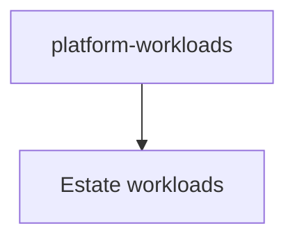

# Visualizations

## Badge Wall

- 
- 
- 
- 
- 
- 
- 
- 
- 
- 
- 
- 
- 
- 
- 
- 
- 

## Dependency Graph (concept)

```mermaid
graph TD
  PlatformWorkloads[platform-workloads] --> Workloads[Estate workloads]
```

---
Generated by scripts/estate-sync/estate_sync.py