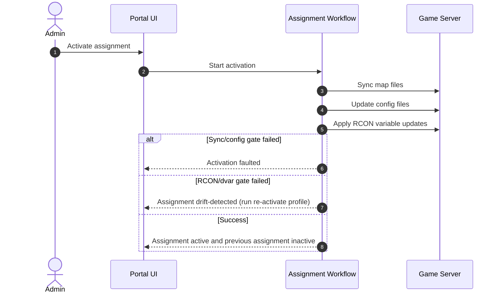
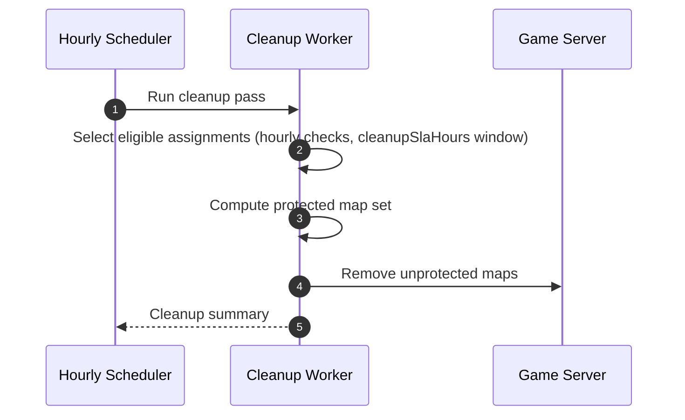
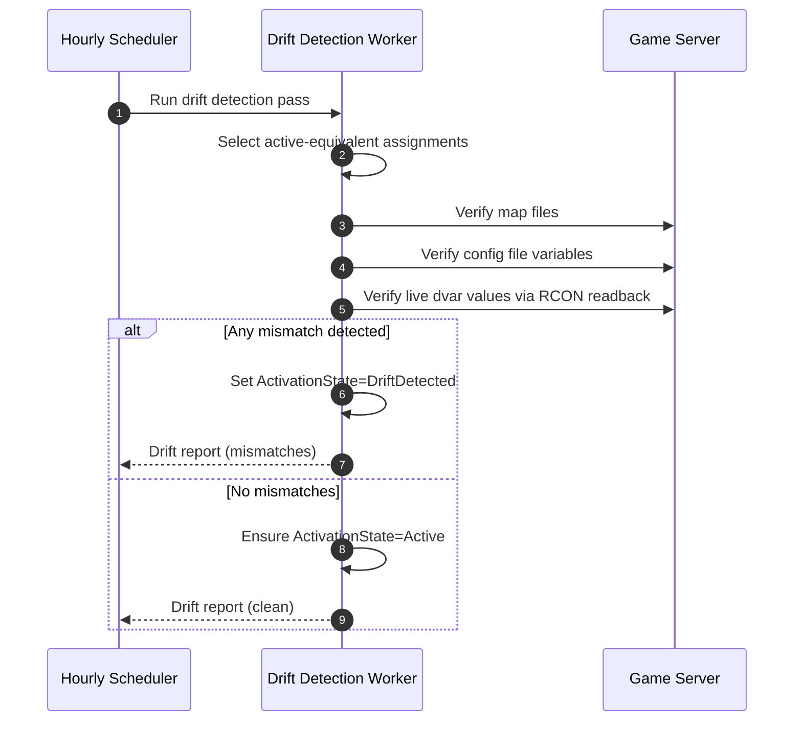

# Map Rotation Workflow Proposal (Draft)

Last updated: 2026-06-28

This document captures a proposed workflow model for map rotations and assignments. It is intended as a working draft that can be refined into the target implementation design.

## Scope

Entities in scope:
- MapRotation
- MapRotationServerAssignment
- MapRotationServerAssignmentConfiguration
- Related references: Map, GameServer

## 1) Entities

Legend:
- <strong>Existing</strong>
- <strong>New Addition</strong>
- <strong>To Be Removed</strong>

### 1.1 MapRotation

| Field                | Notes                                                                     | Classification                                                   |
| -------------------- | ------------------------------------------------------------------------- | ---------------------------------------------------------------- |
| MapRotationId        | Primary key                                                               | <strong>Existing</strong>     |
| GameType             | Rotation game domain                                                      | <strong>Existing</strong>     |
| Title                | Rotation display name                                                     | <strong>Existing</strong>     |
| Description          | Optional richer description for admins                                    | <strong>New Addition</strong> |
| Maps (ordered list)  | Existing concept via MapRotationMap relation                              | <strong>Existing</strong>     |
| State (Status)       | Draft/Testing/Published/Archived                                          | <strong>Existing</strong>     |
| GameMode             | Rotation-level mode used during activation (rotation string + g_gametype) | <strong>Existing</strong>     |
| Version              | Technical version used for deployment/activation tracking                 | <strong>Existing</strong>     |
| ContentHash          | Technical fingerprint for content change detection                        | <strong>Existing</strong>     |
| CreatedAt            | Audit timestamp                                                           | <strong>Existing</strong>     |
| UpdatedAt            | Audit timestamp                                                           | <strong>Existing</strong>     |
| CreatedByUserId      | Audit user                                                                | <strong>Existing</strong>     |
| LastModifiedByUserId | Audit user                                                                | <strong>Existing</strong>     |

State enum:

| Value     | Notes                           | Classification                                               |
| --------- | ------------------------------- | ------------------------------------------------------------ |
| Draft     | Newly created                   | <strong>Existing</strong> |
| Testing   | Under validation                | <strong>Existing</strong> |
| Published | Ready for production activation | <strong>Existing</strong> |
| Archived  | Retired                         | <strong>Existing</strong> |

### 1.2 MapRotationServerAssignment

| Field                         | Notes                                                                                          | Classification                                                    |
| ----------------------------- | ---------------------------------------------------------------------------------------------- | ----------------------------------------------------------------- |
| MapRotationServerAssignmentId | Primary key                                                                                    | <strong>Existing</strong>      |
| MapRotationId                 | Parent rotation reference                                                                      | <strong>Existing</strong>      |
| GameServerId                  | Target server reference                                                                        | <strong>Existing</strong>      |
| DeploymentState               | Operational deployment progress state                                                          | <strong>Existing</strong>      |
| ActivationState               | Activation lifecycle state                                                                     | <strong>Existing</strong>      |
| DeployedVersion               | Last deployed rotation version on server                                                       | <strong>Existing</strong>      |
| ActivatedVersion              | Last activated rotation version on server                                                      | <strong>Existing</strong>      |
| ConfigFilePath                | Flattened single config target (replaced by config rows)                                       | <strong>To Be Removed</strong> |
| ConfigVariableName            | Flattened single variable target (replaced by config rows)                                     | <strong>To Be Removed</strong> |
| PlayerCountMin                | Legacy targeting field removed from target assignment model                                    | <strong>To Be Removed</strong> |
| PlayerCountMax                | Legacy targeting field removed from target assignment model                                    | <strong>To Be Removed</strong> |
| KeepMapsInSync                | Retain assignment maps on server while inactive; default is false (do not auto push on assign) | <strong>New Addition</strong>  |
| CreatedAt                     | Audit timestamp                                                                                | <strong>Existing</strong>      |
| UpdatedAt                     | Audit timestamp                                                                                | <strong>Existing</strong>      |
| ActivatedAt                   | Timestamp of latest activation                                                                 | <strong>New Addition</strong>  |
| DeactivatedAt                 | Timestamp when assignment was deactivated                                                      | <strong>New Addition</strong>  |
| MapsSyncedAt                  | Timestamp of latest successful map sync                                                        | <strong>New Addition</strong>  |
| LastError                     | Error message for most recent failure                                                          | <strong>Existing</strong>      |
| LastErrorAt                   | Timestamp for most recent failure                                                              | <strong>Existing</strong>      |
| UnassignedAt                  | Timestamp when assignment entered removed lifecycle                                            | <strong>Existing</strong>      |

ActivationState enum:

| Value         | Notes                                                       | Classification                                                    |
| ------------- | ----------------------------------------------------------- | ----------------------------------------------------------------- |
| Inactive      | Initial or deactivated state                                | <strong>Existing</strong>      |
| Activating    | Activation is in progress                                   | <strong>Existing</strong>      |
| Active        | Assignment config is live                                   | <strong>Existing</strong>      |
| DriftDetected | Active assignment failed drift checks                       | <strong>New Addition</strong>  |
| Faulted       | Activation failed; admin can retry Activate from this state | <strong>New Addition</strong>  |
| Deactivating  | Transitional deactivation state not used in target proposal | <strong>To Be Removed</strong> |
| Failed        | Legacy failure label replaced by Faulted in proposal        | <strong>To Be Removed</strong> |

Active-equivalent statuses for governance and cleanup guards:
- Active
- DriftDetected

Delete-flow exception:
- Flow S4 permits explicit admin deletion for DriftDetected as a remediation override.

State intent:
- Inactive: Initial state when assignment is created.
- Activating: Assignment activation is in progress.
- Faulted: Activation failed; admin can retry Activate.
- Active: Assignment config and runtime dvar state are live on the server.
- DriftDetected: Drift detection found a mismatch on an active server.

Target scope key:
- Same target means the tuple GameServerId + ConfigFilePath + VariableName per configuration entry.

### 1.3 MapRotationServerAssignmentConfiguration

Each assignment can define multiple activation-time configuration updates.

| Field                                      | Notes                                                                                      | Classification                                                   |
| ------------------------------------------ | ------------------------------------------------------------------------------------------ | ---------------------------------------------------------------- |
| MapRotationServerAssignmentConfigurationId | Row identifier for config entry                                                            | <strong>New Addition</strong> |
| MapRotationServerAssignmentId              | Parent assignment reference (existing concept, new explicit field in this proposed entity) | <strong>New Addition</strong> |
| ConfigFilePath                             | Config file path target (currently on assignment)                                          | <strong>Existing</strong>     |
| VariableName                               | Config variable target (currently on assignment)                                           | <strong>Existing</strong>     |
| VariableValueTemplate                      | Template value, for example {maps}/{maps_subset}                                           | <strong>New Addition</strong> |
| MapSelectionMode                           | How map subsets are resolved for the variable                                              | <strong>New Addition</strong> |
| SelectedMapIds                             | Explicit map selection backing {maps_subset}                                               | <strong>New Addition</strong> |
| SortOrder                                  | Ordering of config application                                                             | <strong>New Addition</strong> |

Example configuration entries:
- server.cfg : sv_maprotation : {maps}
- aacp.cfg : scr_aacp_maps : {maps}
- maprotation.cfg : sv_maprotation_low : {maps_subset}
- ace.cfg : scr_small_rotation : {maps_subset}
- acr.cfg : scr_large_rotation : {maps_subset}

## 2) Rotation Lifecycle

A map rotation is a curated ordered list of maps and metadata.

Nominal lifecycle:
- Draft -> Testing -> Published -> Archived

Transition rule:
- Status values can be changed directly by admins.
- Exception: status transition away from Published is blocked while any assignments are in an active-equivalent status.

Published edit policy:
- Metadata edits on Published rotations are allowed (for example title/description/category/sequence order).
- GameMode remains rotation-level and is not editable while any assignment is in an active-equivalent status (Active or DriftDetected).
- Revision workflow is supported via Clone: admins can clone an existing rotation to a new Draft revision and then publish when ready.

Activation precondition:
- An assignment can only be activated when its rotation is Published.
- If rotation is Draft or Testing, admin should publish first, then activate.

## 3) Assignment Flows

This section separates primary and secondary flows, and states where each flow is triggered from.

Flow classification:
- Primary flows are lifecycle-changing flows that establish or switch the active assignment state on a server.
- Secondary flows are diagnostic, maintenance, or administrative utility flows that support operations around assignments.

### 3.1 Primary Flows (Admin-triggered)

> [!IMPORTANT]
> **Flow P1 (Primary): Create and prepare assignment**
> **Trigger source:** Admin action from map rotation details or server assignment UI.

Flow:
1. Admin creates a MapRotationServerAssignment for a GameServer.
2. Admin defines one or more MapRotationServerAssignmentConfiguration entries.
3. Admin optionally enables KeepMapsInSync (default is off/no).
4. On save, validation rules must pass:

    - Rotation state must be Testing or Published.
    - Duplicate assignment is blocked for the same target tuple (MapRotationId + GameServerId + ConfigFilePath + VariableName).

5. After successful validation:

    - Assignment is created in Inactive.
    - If KeepMapsInSync is enabled, a sync job is automatically queued.
    - If KeepMapsInSync is disabled, no automatic map push occurs on assignment.

---

> [!IMPORTANT]
> **Flow P2 (Primary): Activate or reactivate assignment**
> **Trigger source:** Admin action from assignment details/status UI.

Flow:
1. Admin can activate an assignment only when:

    - Rotation state is Published.
    - DeploymentState is Pending, Synced, PartiallyDeployed, or Failed.
    - DeploymentState is not Removing or Removed.
    - ActivationState is Inactive, Faulted, or DriftDetected.

2. Reactivation/retry is supported directly; admins do not need to recreate assignment configuration/file selection.
3. Admin activates an assignment.
4. System performs stage gates in order:

    - Map file sync
    - Config file update (rotation string built using rotation GameMode)
    - RCON variable update (includes setting g_gametype from rotation GameMode)
    - MapsSyncedAt is set when map file sync succeeds.

5. If map sync or config update fails, activation is blocked (Faulted).
6. If RCON update fails:

    - ActivationState is set to DriftDetected immediately.
    - Active handover does not finalize on this path; previous Active assignment remains Active until a successful re-activation completes.
    - Admin is directed to run Flow S1 in re-activate mode to re-apply config and live dvar values.
    - Drift report includes failed RCON dvar updates.

7. On successful activation:

    - Enforce target invariant: at most one active-equivalent assignment per target.
    - Current assignment becomes Active.
    - Previously Active or DriftDetected assignment on the same target becomes Inactive.
    - ActivatedAt is set for the active assignment.
    - DeactivatedAt is set for the previous assignment.

8. If previous assignment had KeepMapsInSync enabled:

    - Inform admin maps will remain on server.

9. If previous assignment did not have KeepMapsInSync enabled:

    - Inform admin maps become eligible for removal based on cleanup timestamp gates (using the configured cleanup SLA window after DeactivatedAt is set).

### 3.2 Secondary Flows (Admin-triggered)

> [!NOTE]
> **Flow S1 (Secondary): Unified integrity/sync/re-activate function (flag-driven)**
> **Trigger source:** Admin action from assignment page.

Flow:
1. A single function is used for integrity-only checks, sync, and re-activate behavior via explicit skip/feature flags.
2. The function supports these invocation profiles:

    - Integrity-only profile: validate map files, config variables, and live dvar values through RCON without applying updates.
    - Sync profile: apply map/config updates while skipping live dvar re-apply when requested.
    - Re-activate profile: apply map/config updates and re-apply live dvar values through RCON.

3. Validation scope always supports:

    - Map file presence and integrity (expected versions/hashes).
    - Config file/variable value checks for assignment configuration entries.
    - Live dvar value checks through RCON.

4. When re-activate profile succeeds for a Faulted or DriftDetected assignment, set ActivationState to Active.

---

> [!TIP]
> **Flow S2 (Secondary): Check and sync map/config/dvar integrity (active, faulted, or drift-detected path)**
> **Trigger source:** Admin action from assignment page.
> **Faulted-state guidance:** When assignment is Faulted, this flow should be visually highlighted in the UI as the primary route to resolution.

Flow:
1. This is an invocation profile of Flow S1.
2. Admin can run map+config+dvar integrity check when assignment is Active, Faulted, or DriftDetected.
3. System reports missing and mismatched map files.
4. System reports config file/variable mismatches for assignment configuration entries.
5. System reports live dvar mismatches via RCON readback.
6. Admin can trigger on-demand sync of map files, configuration targets, and live dvar values (re-activate behavior).
7. MapsSyncedAt is updated.
8. If assignment is Faulted or DriftDetected and sync/re-activate stages succeed, set ActivationState to Active.

---

> [!NOTE]
> **Flow S3 (Secondary): Map-file-only sync profile (non-active path)**
> **Trigger source:** Admin action from assignment page.

Flow:
1. This is an invocation profile of Flow S1.
2. Admin can trigger map-file-only sync by setting skip flags for config and dvar update stages.
3. MapsSyncedAt is updated.
4. If KeepMapsInSync is disabled, show warning that maps are eligible for removal after the configured cleanup SLA window (default 12 hours).

---

> [!NOTE]
> **Flow S4 (Secondary): Delete assignment**
> **Trigger source:** Admin action from assignment page or assignment list.

Flow:
1. Admin can delete assignment when state is Faulted, DriftDetected, or Inactive.
2. Assignment deletion is blocked for Active and Activating states.
3. Map-file clean-up before delete is optional.
4. If admin skips manual clean-up, delete still proceeds immediately; there is no assignment retention window.
5. Delete hard-removes the assignment record and assignment configuration entries immediately.

### 3.3 Supporting UX and Drift Behavior

Trigger source:
- Admin interaction in assignment UI (for UX helpers).
- System-scheduled detection for drift checks (see section 4.2).

Expected UX helpers:
- KeepMapsInSync must be clearly presented as an explicit toggle with default OFF/No.
- UI help text should explicitly state: maps are not auto-pushed on assignment unless KeepMapsInSync is enabled.
- Config file path selector should browse server files.
- Variable name should default to sv_maprotation and support common mod patterns (for example OpenWarfare and ACE variants).
- {maps} and {maps_subset} should be driven by map multi-select (all selected by default).
- {game_mode} token is not introduced in this proposal; runtime formatting uses rotation GameMode directly.
- Rotation value length strategy follows existing behavior:

    - Max variable value length is 1024 characters.
    - Standard format (for example sv_maprotation) shards overflow into suffixed variables (sv_maprotation_1, sv_maprotation_2, ...).
    - AACP format (for example scr_aacp_maps_1) continues numeric suffixing (scr_aacp_maps_2, scr_aacp_maps_3, ...).
    - Splits preserve map token boundaries.
- A preview should summarize resolved config changes before activation.

Consistency model:
- Eventual consistency is accepted for non-critical status propagation and background reconciliation.
- Target-critical outcomes (activation status, handover, and drift transitions) must remain deterministic per target operation.

Target invariant:
- For a given target (GameServerId + ConfigFilePath + VariableName), there must never be more than one active-equivalent assignment.
- Any transition to Active (including re-activate and drift recovery) must atomically inactivate other active-equivalent assignments for the same target.

Drift state handling:
1. Drift detection checks should evaluate all of:

    - Map file presence and expected versions/hashes.
    - Config file variable values for assignment configuration entries.
    - Live dvar values through RCON readback.

2. If drift is detected for an active assignment:

    - ActivationState is set to DriftDetected.

3. If a subsequent drift check passes for an assignment in DriftDetected:

    - ActivationState is set back to Active.

4. If an admin runs Flow S1/S2 in re-activate profile and map/config/dvar stages all succeed for an assignment in Faulted or DriftDetected:

    - ActivationState is set back to Active.
    - Target invariant enforcement is applied atomically on this transition.

## 4) Scheduled Workflows

### 4.1 Hourly cleanup workflow

A scheduled task runs hourly.

Cleanup SLA policy:
- Cleanup SLA is environment-configurable.
- Default value is 12 hours.
- Deleted assignments are hard-removed immediately and are out of cleanup scope.

Canonical cleanup eligibility predicate:
- KeepMapsInSync is false
- ActivationState is Inactive or Faulted
- AND at least one timestamp gate is met:
    - DeactivatedAt <= now - cleanupSlaHours
        - OR (DeactivatedAt is null AND ActivatedAt is null AND MapsSyncedAt <= now - cleanupSlaHours)
- Null timestamps are ignored for gate checks (they do not satisfy time eligibility by themselves).

Cleanup target set:
- Assignments where KeepMapsInSync is false, ActivationState is Inactive or Faulted, and at least one timestamp gate is met (DeactivatedAt older than cleanupSlaHours, or never-activated assignments with MapsSyncedAt older than cleanupSlaHours).
- Assignments with both DeactivatedAt and MapsSyncedAt null are not eligible for time-based cleanup.

Cleanup behavior:
- Remove only maps not required by active-equivalent or keep-in-sync assignments.
- Respect shared-map usage across multiple rotations.

### 4.2 Hourly drift detection workflow

A scheduled task runs hourly.

Drift detection target set:
- Assignments in active-equivalent status.

Drift detection checks:
- Verify expected map files exist on server and match expected file version/hash.
- Verify each configured variable (ConfigFilePath + VariableName) matches expected resolved value.
- Verify live dvar values through RCON readback for configured runtime keys.

Drift detection behavior:
- If map validation, config validation, or dvar validation fails, mark assignment DriftDetected.
- If all validations pass and assignment is currently DriftDetected, return assignment to Active.
- On-demand re-activate (Flow S1/S2 profile) can also clear DriftDetected when map/config/dvar stages all succeed.
- Persist a drift report that includes map mismatches, missing files, config/variable mismatches, and dvar mismatches.

## 5) Sequence (Proposed)

### 5.1 Activation sequence

### 5.2 Hourly cleanup sequence

### 5.3 Hourly drift detection sequence

## 6) Design Decisions Captured

Confirmed for implementation:
- Published rotations allow metadata edits.
- GameMode stays on MapRotation (no assignment-level override in this proposal).
- GameMode is used during activation for rotation-string formatting and g_gametype RCON updates.
- Editing GameMode is blocked while any assignment is Active or DriftDetected.
- Revision flow uses Clone to create a Draft revision from an existing rotation.
- Rotation-string formatting uses current 1024-character sharding behavior with variable suffix continuation.
- No {game_mode} token is added.
- On RCON/dvar gate failure during activation, assignment moves to DriftDetected (not Active).
- S1/S2/S3 share one flag-driven function with profile-based invocation.
- Eventual consistency is accepted for non-critical status propagation.
- Assignment delete is immediate hard-delete (no retention window for assignment records).
- Cleanup SLA is environment-configurable with default 12 hours and hourly evaluation for retained assignments.
- PlayerCountMin/PlayerCountMax targeting fields are removed from the target model.

## 7) Current Implementation Coverage Review (Code-Anchored)

> [!IMPORTANT]
> This section reviews the proposal against the current implementation in portal-repository, portal-web, and portal-sync.
> 
> Coverage labels:
> - <strong>Stays As-Is</strong>
> - <strong>Modified In Proposal</strong>
> - <strong>Removed/Replaced In Proposal</strong>

| Current Feature / Behavior / Nuance                                                                                                                       | Current Code Evidence                                                                                                                                                                                                                                                                                                             | Proposal Coverage                                                                                                                                                    |
| --------------------------------------------------------------------------------------------------------------------------------------------------------- | --------------------------------------------------------------------------------------------------------------------------------------------------------------------------------------------------------------------------------------------------------------------------------------------------------------------------------- | -------------------------------------------------------------------------------------------------------------------------------------------------------------------- |
| Rotation-level `GameMode` is canonical and used during activation (`rotation string` + `g_gametype`)                                                      | `portal-repository/src/XtremeIdiots.Portal.Repository.Abstractions.V1/Models/V1/MapRotations/MapRotationDto.cs:37`, `portal-repository/src/XtremeIdiots.Portal.Repository.Api.V1/Mapping/MapRotationsMappingExtensions.cs:81-83`, `portal-sync/src/XtremeIdiots.Portal.Sync.App/MapRotations/MapRotationOrchestrators.cs:642-643` | <strong>Stays As-Is</strong>                                                                                           |
| Rotation lifecycle values `Draft/Testing/Published/Archived`                                                                                              | `portal-repository/src/XtremeIdiots.Portal.Repository.Abstractions.V1/Constants/V1/MapRotationStatus.cs:5-8`                                                                                                                                                                                                                      | <strong>Stays As-Is</strong>                                                                                           |
| Map list updates compute `ContentHash` and bump `Version` when changed                                                                                    | `portal-repository/src/XtremeIdiots.Portal.Repository.Api.V1/Controllers/V1/MapRotationsController.cs:338-351`                                                                                                                                                                                                                    | <strong>Stays As-Is</strong>                                                                                           |
| Duplicate config target prevention uses `(MapRotationId, GameServerId, ConfigFilePath, ConfigVariableName)` guard                                         | `portal-repository/src/XtremeIdiots.Portal.Repository.Api.V1/Controllers/V1/MapRotationsController.cs:591-592`, `portal-repository/src/XtremeIdiots.Portal.Repository.Api.V1/Controllers/V1/MapRotationsController.cs:681-682`                                                                                                    | <strong>Stays As-Is</strong>                                                                                           |
| Activating a target performs active handover by inactivating previous active assignment(s) for the same target                                            | `portal-repository/src/XtremeIdiots.Portal.Repository.Api.V1/Controllers/V1/MapRotationsController.cs:699-712`                                                                                                                                                                                                                    | <strong>Stays As-Is</strong>                                                                                           |
| Variable-value sharding behavior (1024 max length + overflow variable continuation)                                                                       | `portal-sync/src/XtremeIdiots.Portal.Sync.App/MapRotations/MapRotationActivities.cs:287`, `portal-sync/src/XtremeIdiots.Portal.Sync.App/MapRotations/MapRotationActivities.cs:322`, `portal-sync/src/XtremeIdiots.Portal.Sync.App/MapRotations/MapRotationModels.cs:71`                                                           | <strong>Stays As-Is</strong>                                                                                           |
| Manual admin flows for Activate/Deactivate/Verify remain explicit UI actions                                                                              | `portal-web/src/XtremeIdiots.Portal.Web/Controllers/MapRotationsController.cs:985`, `portal-web/src/XtremeIdiots.Portal.Web/Controllers/MapRotationsController.cs:1066`, `portal-web/src/XtremeIdiots.Portal.Web/Controllers/MapRotationsController.cs:1109`                                                                      | <strong>Stays As-Is</strong>                                                                                           |
| `ActivationState` currently uses `Inactive/Activating/Active/Deactivating/Failed` (no `Faulted`, no `DriftDetected`)                                      | `portal-repository/src/XtremeIdiots.Portal.Repository.Abstractions.V1/Constants/V1/ActivationState.cs:5-9`                                                                                                                                                                                                                        | <strong>Removed/Replaced In Proposal</strong> with `Faulted` + `DriftDetected` model                                   |
| Assignment currently stores single flattened config target (`ConfigFilePath` + `ConfigVariableName`)                                                      | `portal-repository/src/XtremeIdiots.Portal.Repository.Database/dbo/Tables/MapRotationServerAssignments.sql:10-11`, `portal-repository/src/XtremeIdiots.Portal.Repository.Abstractions.V1/Models/V1/MapRotations/MapRotationServerAssignmentDto.cs:49-52`                                                                          | <strong>Removed/Replaced In Proposal</strong> by `MapRotationServerAssignmentConfiguration` rows                       |
| Current assignment contract does not include `KeepMapsInSync`, `ActivatedAt`, `DeactivatedAt`, `MapsSyncedAt`                                             | `portal-repository/src/XtremeIdiots.Portal.Repository.Abstractions.V1/Models/V1/MapRotations/MapRotationServerAssignmentDto.cs:9`, `portal-repository/src/XtremeIdiots.Portal.Repository.Abstractions.V1/Models/V1/MapRotations/MapRotationServerAssignmentDto.cs:49-73`                                                          | <strong>Modified In Proposal</strong> (new fields + new cleanup eligibility semantics)                                 |
| Verify flow currently records operation success/failure but does not set assignment drift state                                                           | `portal-sync/src/XtremeIdiots.Portal.Sync.App/MapRotations/MapRotationOrchestrators.cs:934-938`, `portal-sync/src/XtremeIdiots.Portal.Sync.App/MapRotations/MapRotationOrchestrators.cs:944-945`                                                                                                                                  | <strong>Modified In Proposal</strong> (hourly drift workflow + `DriftDetected` transitions)                            |
| Cleanup currently uses hard-coded retention/reconciliation windows: 48h removed retention, 15m stale-removing reconciliation, 1h in-progress remove grace | `portal-sync/src/XtremeIdiots.Portal.Sync.App/MapRotations/MapRotationCleanup.cs:54-56`, `portal-sync/src/XtremeIdiots.Portal.Sync.App/MapRotations/MapRotationCleanup.cs:62-100`, `portal-sync/src/XtremeIdiots.Portal.Sync.App/MapRotations/MapRotationCleanup.cs:133-141`                                                      | <strong>Modified In Proposal</strong> (environment-configurable cleanup SLA and timestamp-based policy)                |
| UI supports force-unassign shortcut (directly marks assignment removed + sets `UnassignedAt`)                                                             | `portal-web/src/XtremeIdiots.Portal.Web/Controllers/MapRotationsController.cs:811-821`, `portal-web/src/XtremeIdiots.Portal.Web/Controllers/MapRotationsController.cs:830`                                                                                                                                                        | <strong>Modified In Proposal</strong> (S4 re-scoped around target-state states and cleanup rules)                      |
| UI currently auto-promotes rotation to `Published` after successful activate trigger when rotation is `Draft` or `Testing`                                | `portal-web/src/XtremeIdiots.Portal.Web/Controllers/MapRotationsController.cs:994`, `portal-web/src/XtremeIdiots.Portal.Web/Controllers/MapRotationsController.cs:1009-1017`                                                                                                                                                      | <strong>Modified In Proposal</strong> (proposal keeps explicit published precondition and optional helper)             |
| Sync has nuanced skip/partial semantics: built-in map skip, no-file skip, and AACP shared-map partial-deploy paths                                        | `portal-sync/src/XtremeIdiots.Portal.Sync.App/MapRotations/MapRotationActivities.cs:21-41`, `portal-sync/src/XtremeIdiots.Portal.Sync.App/MapRotations/MapRotationOrchestrators.cs:56`, `portal-sync/src/XtremeIdiots.Portal.Sync.App/MapRotations/MapRotationOrchestrators.cs:145`                                               | <strong>Modified In Proposal</strong> (proposal keeps integrity/sync intent but should preserve these runtime nuances) |
| Assignment model currently includes player-count targeting (`PlayerCountMin/PlayerCountMax`)                                                              | `portal-repository/src/XtremeIdiots.Portal.Repository.Abstractions.V1/Models/V1/MapRotations/MapRotationServerAssignmentDto.cs:55-58`, `portal-repository/src/XtremeIdiots.Portal.Repository.Database/dbo/Tables/MapRotationServerAssignments.sql:12-13`                                                                          | <strong>Removed/Replaced In Proposal</strong> (explicitly removed from target assignment model)                        |

> [!NOTE]
> Summary of coverage outcome:
> - The proposal is aligned with core lifecycle intent, but includes explicit behavioral deltas from current production mechanics.
> - The largest implementation deltas are the state taxonomy (`Faulted`/`DriftDetected`), config-row normalization, and cleanup/drift policy model.
> - Existing operational nuances (AACP shared-map handling, force-unassign, stale-removing reconciliation) should be explicitly carried forward during implementation planning.
