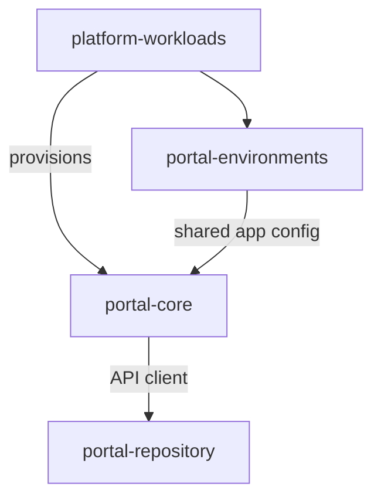

# Visualizations

## Dependency Graph (concept)

- Replace the placeholders with generated nodes/edges from `platform-workloads` once the automation is in place.
- Mermaid works well for quick sketches; for pipeline status overlays, embed live badge links next to nodes in the Markdown surrounding the diagram.

## Badge Wall (idea)

Use a generated grid of badges (one per release pipeline) as a quick failure heatmap. This can live in [route-to-production](route-to-production.md) or an accompanying GitHub Pages site.
